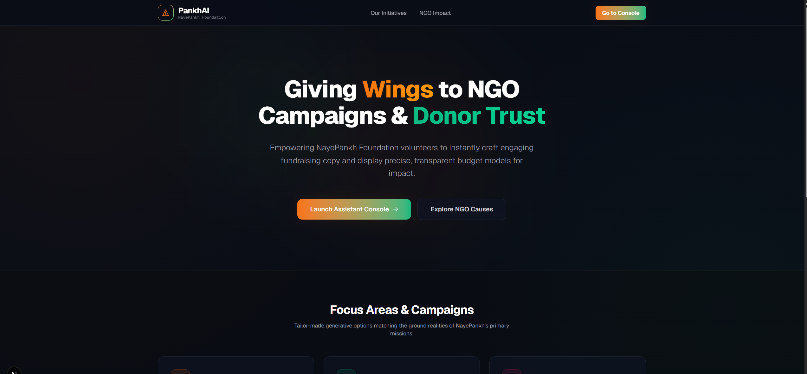
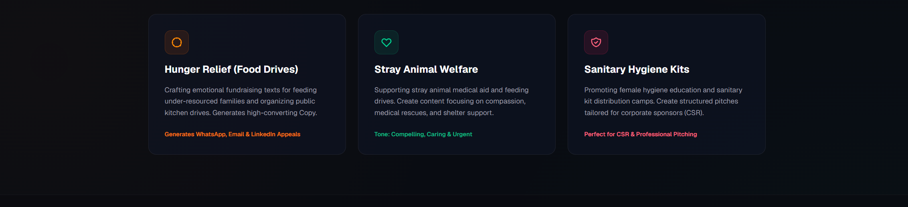
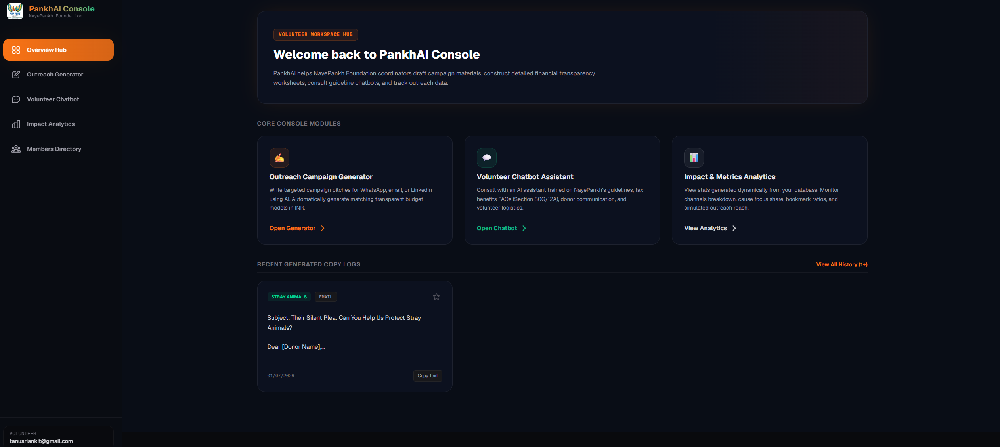
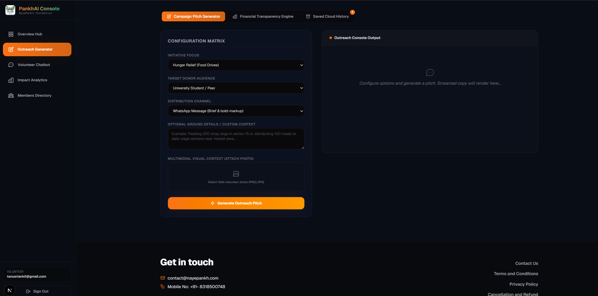
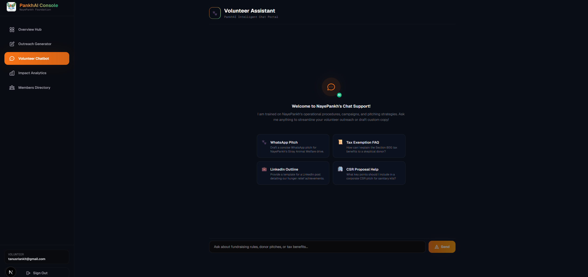
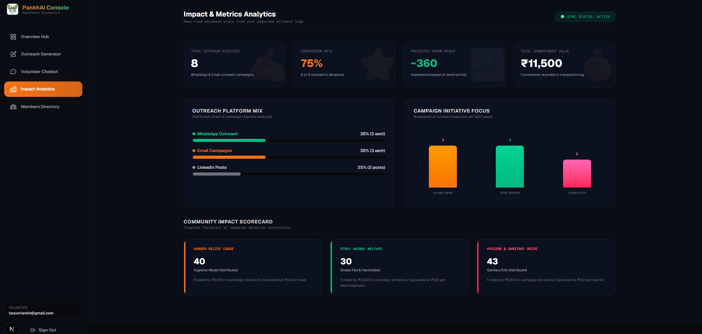
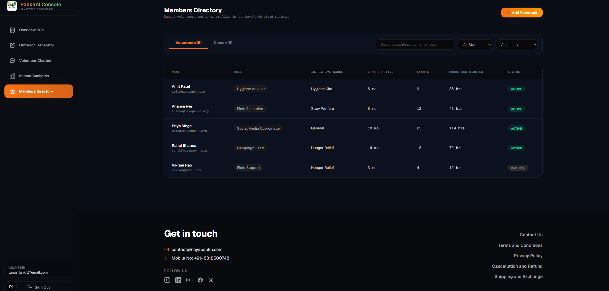
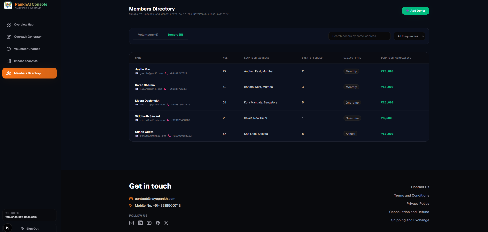
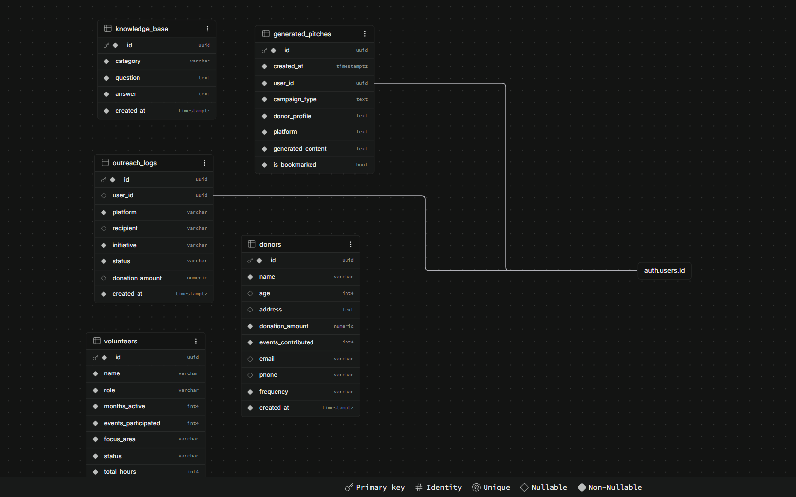
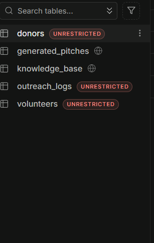

#  PankhAI — NGO Campaign Coprocessor & Trust Budgeting Suite

PankhAI is a tailored administrative console and generative workspace designed for the volunteers and coordinators of **NayePankh Foundation** (a registered, tax-exempt NGO in India dedicated to uplifting underprivileged communities). 

PankhAI bridges the gap between grassroots charity work, generative copywriting, and donor transparency by providing volunteers with a set of tools to craft campaigns, analyze budget trust models, interact with an AI volunteer assistant, and maintain coordinator directories.

---

## 📸 Visual Previews

### Landing Page & Portal



### Administrative Dashboard Overview


---

## 🌟 Core Features

### 1. Outreach Copywriting Generator
- **Generative Copy Editor**: Allows coordinators to input target demographics (e.g. general public, corporate sponsors), select causes (e.g., child education, food drive, hygiene camp), choose a campaign tone (e.g., urgent, professional, inspiring), and instantly generate conversion-optimized fundraising copy.
- **Copy Actions**: Copy generated results directly to clipboard or trigger mail-sender simulation tools.



### 2. Volunteer Support Chatbot
- **Intelligent Assistant**: An interactive AI chat console designed to answer coordinator queries, guide donor relation calls, suggest marketing messaging strategy, and explain tax exemption benefits (e.g., Section 80G deductions under Indian Income Tax).



### 3. Impact Analytics & Transparency Engine
- **Trust Budgeting Suite**: Enables volunteers to build public-facing transparent budget projections.
- **Data Visualization**: Employs interactive charts (via Recharts) displaying transparency indicators, allocation splits (e.g., logistics vs. direct aid), and volunteer mobilization indicators.
- **Clean Reports**: Provides breakdown matrices detailing how every single rupee donated directly impacts the target audience.



### 4. Members Directory
- **Coordinator Board**: A listing directory mapping volunteer coordinates, registration IDs, assigned campaigns, and active statuses across operations in Kanpur, Ghaziabad, and Kanpur suburbs.




## 🛠️ Tech Stack & Dependencies

- **Framework**: Next.js 15+ (App Router, Client & Server Components, Suspense boundary patterns)
- **Styling**: Tailwind CSS (v4) with vanilla variables custom-injected
- **Backend & Auth**: Supabase Database & Supabase Auth Client
- **Charts**: Recharts (ResponsiveContainer, PieChart, BarChart, Tooltip)
- **Icons**: Lucide React / Custom Inline SVGs
- **Copying**: Clipboard API wrappers

---

## 🗄️ Database Architecture

PankhAI utilizes Supabase (PostgreSQL) for relational data storage and authentication. Below is the database schema design and table structures mapping volunteers, donors, and active campaigns:

### Schema Diagram


### Table Configurations


---

## 📂 Project Structure

```bash
pankhai/
├── public/
│   ├── assets/
│   │   └── naypankhlogo.png  # Official NayePankh Foundation Logo
│   └── vercel.svg
├── src/
│   ├── app/
│   │   ├── api/
│   │   │   └── send/          # Simulated email routes
│   │   ├── auth/              # Supabase callback handlers
│   │   ├── dashboard/         # Post-login Console layout & pages
│   │   │   ├── analytics/     # Impact Analytics module
│   │   │   ├── chatbot/       # Volunteer Chatbot assistant
│   │   │   ├── directory/     # Members Directory lists
│   │   │   └── generator/     # Outreach Copywriter workspace
│   │   ├── login/             # Vibrant light-themed login portal
│   │   ├── globals.css        # Core Tailwind configurations
│   │   ├── layout.tsx         # Next.js global root layout
│   │   └── page.tsx           # Product landing page
│   └── lib/
│       └── supabase/          # Supabase client declarations
```

---

## 🚀 Getting Started

### Prerequisites
Make sure you have Node.js (v18.x or above) and npm installed.

### 1. Clone & Install Dependencies
Navigate into the workspace and run:
```bash
npm install
```

### 2. Environment Configurations
Create a `.env` file in the project root:
```env
NEXT_PUBLIC_SUPABASE_URL=your_supabase_project_url
NEXT_PUBLIC_SUPABASE_ANON_KEY=your_supabase_anon_public_key
GOOGLE_GENERATIVE_AI_API_KEY=YOUR_GEMINI_API_KEY
```

### 3. Run Development Server
Start the Next.js development server locally:
```bash
npm run dev
```
Open [http://localhost:3000](http://localhost:3000) in your browser to view the application.

### 4. Build for Production
To generate a production-optimized build:
```bash
npm run build
npm run start
```

